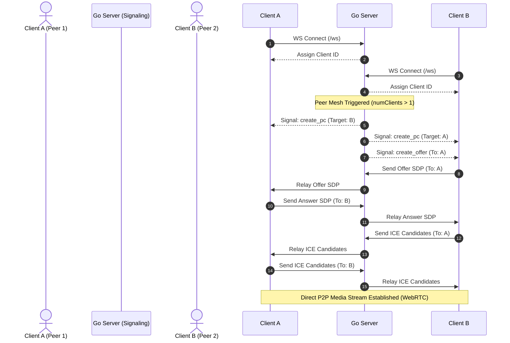
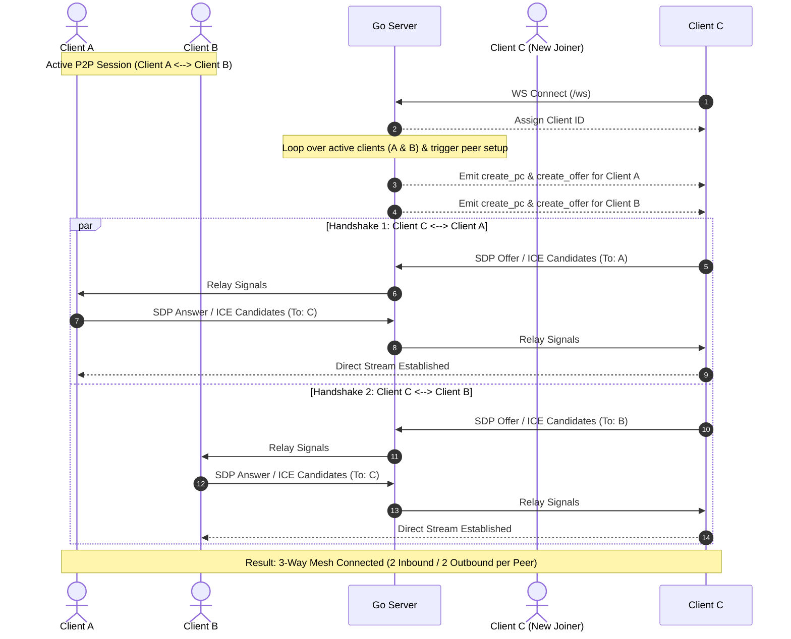

# WebRTC Video App 

> A real-time, multi-party peer-to-peer video conferencing application built with a lightweight **Go** signaling server, native JavaScript **WebRTC API**, and concurrent **WebSockets**.

---

## What the Project Does

`webrtcvideoapp` is a decentralized, mesh-networked video communication platform that allows multiple clients to connect, share real-time audio/video streams, and automatically manage dynamic peer connection lifecycles.

* **Multi-User Video Conferencing**: Connects multiple clients concurrently by instantiating isolated peer connections between every participant pair.
* **Asynchronous Signaling Pipeline**: Manages complex SDP exchange (offers and answers) and ICE candidate delivery through a centralized Go WebSocket server.
* **Dynamic Lifecycle Management**: Handles media device constraints, client joins, and remote peer teardowns upon disconnection automatically.

---

## How It Works

1. **Client Initialization & Media Capture**:
   Upon connecting to `ws://localhost:8080/ws`, the browser prompts for camera and microphone access (`getUserMedia`). Capture constraints default to 320x240 @ 15fps for optimized stream transport.
2. **Session Registration & ID Assignment**:
   The Go backend upgrades the HTTP connection to a persistent WebSocket, registers the client's network address as a unique `clientID`, and returns it to the frontend.
3. **Automated Peer Mesh Creation**:
   When a new client joins an active session:
   * The Go server emits `create_pc` and `create_offer` control signals to both the new participant and existing peers.
   * Clients generate local `RTCPeerConnection` instances configured with Google's public STUN server (`stun:stun.l.google.com:19302`).
4. **SDP & ICE Candidate Handshake**:
   * Participants exchange Session Description Protocol (SDP) payloads (`offer` and `answer`) via the Go server.
   * ICE candidates are gathered asynchronously, queued, and dispatched once gathering completes (`iceGatheringState === 'complete'`).
5. **Stream Rendering & Teardown**:
   * Media tracks received on remote peer connections dynamically create `<video>` elements inside `#remoteVideos`.
   * Disconnections trigger a `client_disconnect` broadcast, prompting remaining clients to close specific peer connections and clean up the DOM.

---

## System Architecture

### 1. Two-Client Handshake Flow (Basic P2P)



---

### 2. Multi-Client Full Mesh Architecture (3+ Participants)

When a third or fourth participant joins, the Go server iterates over all existing sockets and triggers parallel handshakes to build a full mesh network ($N = \frac{n(n-1)}{2}$).



---

## Tech Stack

* **Backend**: Go (`net/http`, `sync.Mutex` for thread-safe state management)
* **WebSocket Library**: Gorilla WebSocket (`github.com/gorilla/websocket`)
* **Frontend**: Vanilla JavaScript (ES6+ Async/Await, MediaDevices API, WebRTC API)
* **NAT Traversal**: STUN (`stun:stun.l.google.com:19302`)
* **Protocols**: WebSockets (Signaling), SRTP/ICE/STUN (P2P Streaming)

---

## Prerequisites

* **Go**: Version 1.22.4 or higher installed on your system.

---

## Installation & Setup

1. **Clone the Repository**:
   ```bash
   git clone https://github.com/sriyavemuri26/webrtcvideoapp.git
   cd webrtcvideoapp
   ```

2. **Sync Dependencies**:
   ```bash
   go mod tidy
   ```

3. **Build the Application**:
   ```bash
   go build
   ```

4. **Run the Executable**:

   Windows:
   ```powershell
   ./video-app.exe
   ```

   macOS / Linux:
   ```bash
   ./webrtcvideoapp
   ```

5. **Access the Application**:
   Open [http://localhost:8080](http://localhost:8080) in your web browser. Open additional tabs or incognito windows to test multi-party calls.

---

## Technical Retrospective & Scalability Limits

### Mesh Topology Trade-offs

While a P2P Full Mesh architecture eliminates media server bandwidth costs by routing video directly between peers, connection complexity grows quadratically $O(n^2)$.

* **Scale Threshold**: Reliable up to **4–5 concurrent participants**. Beyond 5 users, client-side CPU encoding overhead and upload bandwidth saturation degrade performance and increase frame drop rates.
* **Future Scalability (SFU Transition)**: Supporting 10+ concurrent users per room requires upgrading from P2P Mesh to a **Selective Forwarding Unit (SFU)** model (e.g., using Pion in Go). An SFU receives a single upload stream from each user and forwards it to all other clients, reducing client upload overhead to $O(1)$.

---

## What I Learned

* **Thread-Safe WebSocket Management**: Implemented Go sync primitives (`sync.Mutex`) to safely manage concurrent writes and avoid race conditions when broadcasting signaling structs (`Signal`) across connected client maps.
* **Asynchronous WebRTC State Synchronization**: Built a robust front-end signal queue (`signalQueue`) to cache incoming offer/answer signals and ICE candidates until local media initialization (`getUserMedia`) finishes.
* **Batch ICE Candidate Gathering**: Handled candidate exchange using promises (`waitForIceCandidates`) to bundle and transfer candidates cleanly once gathering reaches a `complete` state.
* **Dynamic DOM & Track Cleanup**: Managed resource teardown cycles by properly unbinding `MediaStream` tracks and destroying dynamic video elements on client disconnections.
